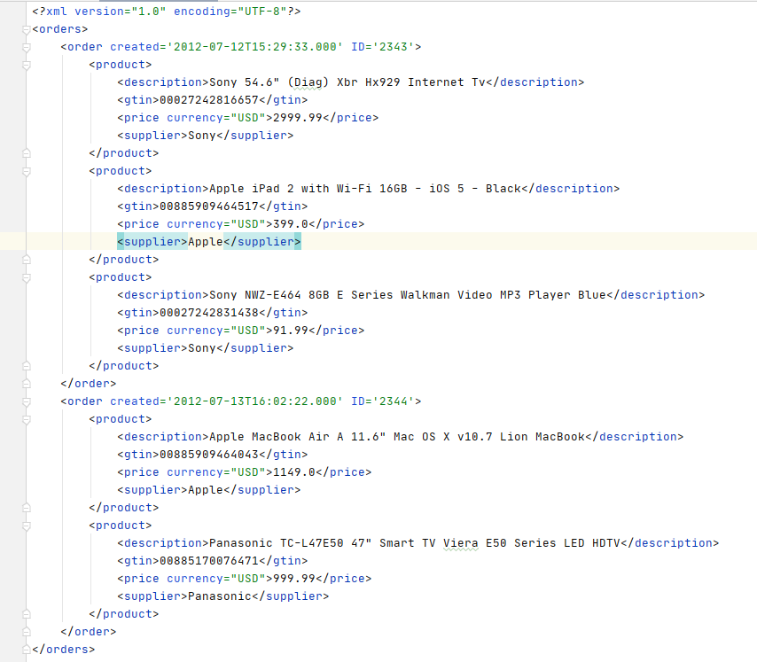
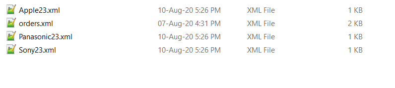
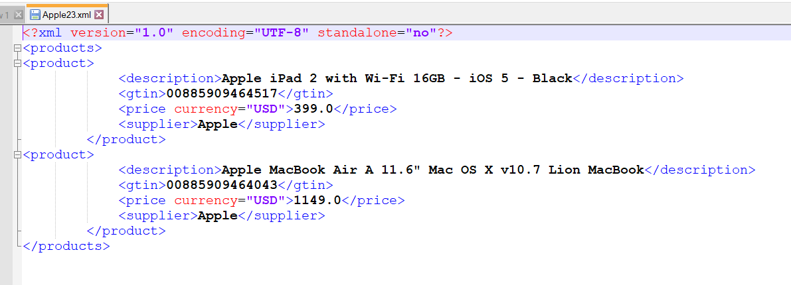

# SpringBoot app for parsing xml files.

#### Local Environment Setup:
##### Prerequisites:
* Maven 3.6.2 +
* Tomcat 9
* Java 8

##### Setup steps:

* Build project ` mvn clean install -DskipTests`
* Start application.
    * Start using embedded server tomcat. -\> Start `main` method from `org.example.Main`
    * Start using standalone server tomcat. -\> Copy `{ProjectFolder}/target/parser-*.war` to `{TomcatFolder}/webapps/`. Start Tomcat.
* Verify. Run `GET http://localhost:8080/status`. expect `{"status": "UP"}`

* Update properties from `application.properties`
        * refreshRate. Ex:`5000`

#### Unit Test Command:
* `mvn clean test-compile test`

# The problem.

# Solution

# Additional Notes